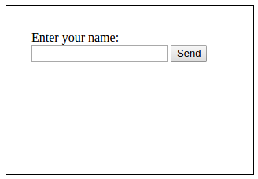
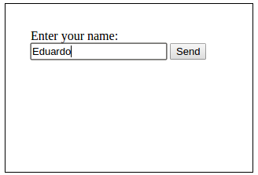
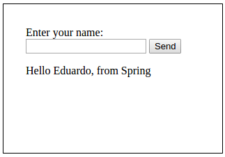

# Farandula Quantum-HMO Research Repository

Topics to research:

- Basic web-app
- Git workflow
- Tests workflow
- Deployment

## Basic web-app

The content of this topic can be found in the `web-app` directory.

A basic web application implemented with a ReactJS front-end and:
- A Java (Spring) back-end
- A Ruby (on Rails) back-end
- A Javascript (Node) back-end

The front-end looks like this:



The user must be able to type a name on the input field:



The user must be able to click the button to send the name to the backend,
then the backend should respond with a message, and the frontend should display
it on the page:



The backend should implement a RESTful API accepting a `name` parameter and
responding with the following JSON:

```JSON
{
  message: "Hello <name>, from <backend>"
}
```

where `<name>` corresponds to the one entered in the text input field, and
`<backend>` corresponds to either Spring, Ruby on Rails, or Node.

## Git workflow

The content of this topic can be found in the `git-workflow` directory.

## Tests workflow

The content of this topic can be found in the `tests-workflow` directory.

## Deployment

The content of this topic can be found in the `deployment` directory.
